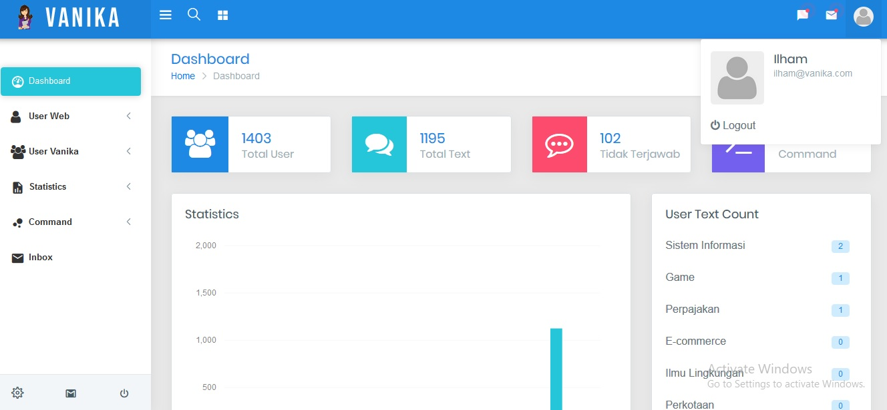

## Vanika-Admin-Dashboard
Vanika admin dashboard adalah web yang bertujuan untuk menampilkan dan mengolah data dari [Vanika ChatBot](https://github.com/IlhamriSKY/vanika-chatbot-line)

Data yang di olah berupa data user dari token sampai email, lalu user message command dan text.

## Next To Do?
- [x] Add Ajax Count (Untuk menampilkan data realtime refresh setiap 1h sekali)
	- [x]Jadi datanya yang keload setiap 1jam sekali disimpan dalam cache(REDIS, MEMCACHED)
- [x] Add Ajax CRUD (Untuk mengolah data realtime tanpa di refresh)
- [x] Add Gmail smtp untuk mengolah email admin
- [x] Add Vanikabot Uptime
- [x] Mengolah notifikasi
